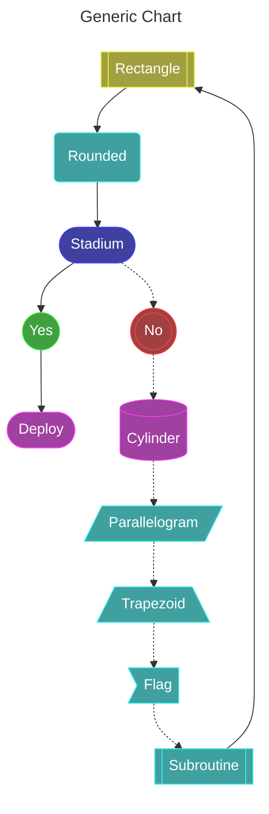

```mermaid
---
title: 'Generic Chart'
---
%%{ init: { 'fontFamily': 'Verdana' } } }%%
%% flowchart LR RL TB BT
flowchart TD 
  A[[Rectangle]] --> B(Rounded)
  B --> C([Stadium])
  C --> Y((Yes)) --> D([Deploy])
  C -.-> N(((No))) -.-> E[(Cylinder)]
  E -.-> F[/Parallelogram/]
  F -.-> G[/Trapezoid\]
  G -.-> H>Flag]
  H -.-> I[[Subroutine]]
  I -->A
%% additional configurations
classDef red fill:#a04040,stroke:#f04040,color:#ffffff;
classDef ylw fill:#a0a040,stroke:#f0f040,color:#ffffff;
classDef grn fill:#40a040,stroke:#40f040,color:#ffffff;
classDef cyn fill:#40a0a0,stroke:#40f0f0,color:#ffffff;
classDef blu fill:#4040a0,stroke:#4040f0,color:#ffffff;
classDef prp fill:#a040a0,stroke:#f040f0,color:#ffffff;
class Y grn
class N red
class A ylw
class B,F,G,H,I cyn
class C blu
class D,E prp
```
